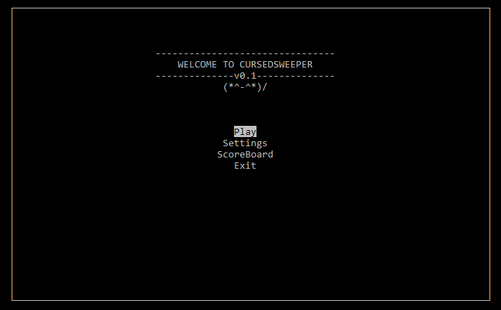

# ConsoleSweeper
An app written in Python that plays a version of Minesweeper which runs directly in the terminal. Uses the `curses` library to simulate a GUI via character-cell manipulation.

## How to Play
Download or fork this repository, then navigate to this folder in the terminal.

To start the game, run:
```bash
$> python3 CursedSweeper.py
```
## Images
Main Menu:  
  

Game Screen:  


Created for UCSD VIS141A - Computer Programming for the Arts.
